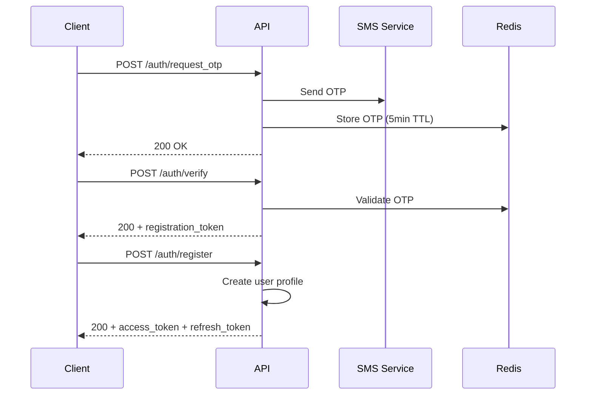
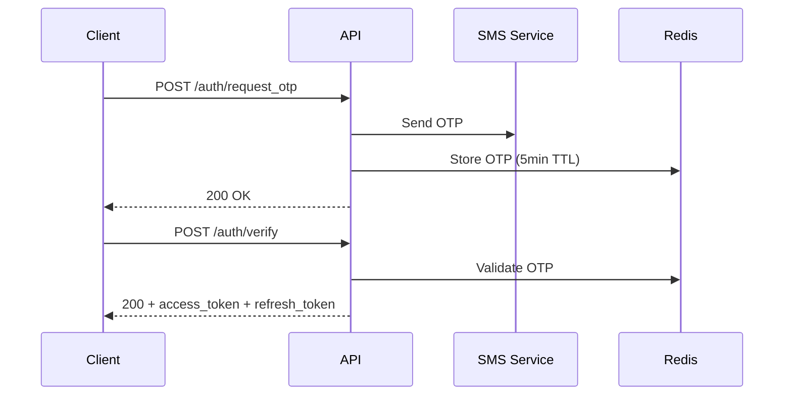
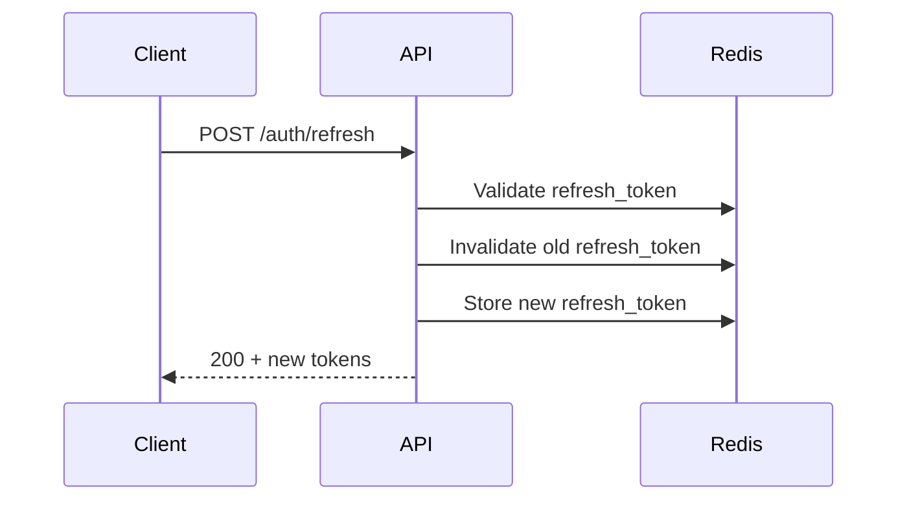

# Authentication API

The Saathii Backend API uses OTP-based authentication with JWT tokens for secure access control.

## Overview

- **OTP-based login** with optional registration step
- **JWT token management** with refresh token rotation
- **Rate limiting** for OTP requests
- **Secure token storage** with Redis-based session management

## Token Model

- **Access Token**: Short-lived (~30 minutes), used in `Authorization: Bearer <access>`
- **Refresh Token**: Long-lived (~30 days), rotated on refresh, stored server-side in Redis
- **Registration Token**: Short-lived (~10 minutes), used only to finalize registration

## Endpoints

### Request OTP

Send an OTP to a phone number for authentication.

**Endpoint:** `POST /auth/request_otp`

**Request Body:**
```json
{
  "phone": "+919876543210"
}
```

**Responses:**
- `200 OK` - OTP sent successfully
  ```json
  {
    "message": "OTP sent"
  }
  ```
- `429 Too Many Requests` - Rate limit exceeded (5 requests per 15 minutes)

**Rate Limiting:**
- Maximum 5 OTP requests per phone number per 15 minutes
- Rate limit resets after 15 minutes of inactivity

### Resend OTP

Resend OTP to a phone number.

**Endpoint:** `POST /auth/resend_otp`

**Request Body:**
```json
{
  "phone": "+919876543210"
}
```

**Behavior:**
- Throttle: 1 resend per 60 seconds per phone
- If an OTP is active, re-sends the same code without changing its TTL
- If no OTP is active, generates and sends a new code (5 minute TTL)

**Responses:**
- `200 OK` - OTP re-sent or sent
  ```json
  {
    "message": "OTP re-sent"
  }
  ```
- `429 Too Many Requests` - Throttle limit exceeded

### Verify OTP

Verify the OTP and get authentication tokens.

**Endpoint:** `POST /auth/verify`

**Request Body:**
```json
{
  "phone": "+919876543210",
  "otp": "123456"
}
```

**Responses:**

**Registered User (200 OK):**
```json
{
  "status": "registered",
  "access_token": "eyJhbGciOiJIUzI1NiIsInR5cCI6IkpXVCJ9...",
  "refresh_token": "eyJhbGciOiJIUzI1NiIsInR5cCI6IkpXVCJ9..."
}
```

**New User - Needs Registration (200 OK):**
```json
{
  "status": "needs_registration",
  "registration_token": "eyJhbGciOiJIUzI1NiIsInR5cCI6IkpXVCJ9..."
}
```

**Error Responses:**
- `400 Bad Request` - Invalid or expired OTP
- `404 Not Found` - OTP not found for phone number

### Register User

Complete user registration with profile information.

**Endpoint:** `POST /auth/register`

**Request Body:**
```json
{
  "registration_token": "eyJhbGciOiJIUzI1NiIsInR5cCI6IkpXVCJ9...",
  "username": "alice",
  "sex": "female",
  "dob": "2000-01-01",
  "bio": "Professional listener with 5 years experience...",
  "interests": ["music", "tech", "art"],
  "profile_image_url": "https://example.com/profile.jpg",
  "preferred_language": "en",
  "role": "listener"
}
```

**Required Fields:**
- `registration_token` - Token from OTP verification
- `username` - Unique username
- `sex` - "male", "female", or "other"
- `dob` - Date of birth (YYYY-MM-DD)
- `role` - "listener" or "user"

**Optional Fields:**
- `bio` - User biography
- `interests` - Array of interest tags
- `profile_image_url` - Profile image URL
- `preferred_language` - Language preference (default: "en")

**Response:**
```json
{
  "access_token": "eyJhbGciOiJIUzI1NiIsInR5cCI6IkpXVCJ9...",
  "refresh_token": "eyJhbGciOiJIUzI1NiIsInR5cCI6IkpXVCJ9..."
}
```

### Refresh Tokens

Get a new access token using a refresh token.

**Endpoint:** `POST /auth/refresh`

**Request Body:**
```json
{
  "refresh_token": "eyJhbGciOiJIUzI1NiIsInR5cCI6IkpXVCJ9..."
}
```

**Response:**
```json
{
  "access_token": "eyJhbGciOiJIUzI1NiIsInR5cCI6IkpXVCJ9...",
  "refresh_token": "eyJhbGciOiJIUzI1NiIsInR5cCI6IkpXVCJ9..."
}
```

**Notes:**
- Refresh tokens are single-use
- If a refresh token is reused, server returns 401
- New refresh token is provided on successful refresh

### Logout

Logout and invalidate all tokens for the user.

**Endpoint:** `POST /auth/logout`

**Headers:**
```
Authorization: Bearer <access_token>
```

**Response:**
```json
{
  "message": "Logged out"
}
```

**Behavior:**
- Blacklists current access token
- Revokes all refresh tokens for the user
- User must re-authenticate to access protected endpoints

## Authentication Flow

### 1. New User Registration



### 2. Existing User Login



### 3. Token Refresh



## Error Handling

### Common Error Responses

**Invalid OTP (400):**
```json
{
  "detail": "Invalid or expired OTP"
}
```

**Rate Limit Exceeded (429):**
```json
{
  "detail": "Rate limit exceeded. Try again later."
}
```

**Invalid Token (401):**
```json
{
  "detail": "Could not validate credentials"
}
```

**Registration Token Expired (400):**
```json
{
  "detail": "Registration token expired"
}
```

## Security Features

- **Rate Limiting**: Prevents OTP spam attacks
- **Token Rotation**: Refresh tokens are rotated on each use
- **Token Blacklisting**: Logout invalidates all user tokens
- **Secure Storage**: Tokens stored in Redis with TTL
- **JWT Validation**: All tokens validated on each request

## Integration Examples

### React Native Integration

```typescript
// Request OTP
const requestOTP = async (phone: string) => {
  const response = await fetch('https://saathiiapp.com/auth/request_otp', {
    method: 'POST',
    headers: { 'Content-Type': 'application/json' },
    body: JSON.stringify({ phone })
  });
  return response.json();
};

// Verify OTP
const verifyOTP = async (phone: string, otp: string) => {
  const response = await fetch('https://saathiiapp.com/auth/verify', {
    method: 'POST',
    headers: { 'Content-Type': 'application/json' },
    body: JSON.stringify({ phone, otp })
  });
  return response.json();
};
```

### cURL Examples

**Request OTP:**
```bash
curl -X POST 'https://saathiiapp.com/auth/request_otp' \
  -H 'Content-Type: application/json' \
  -d '{"phone":"+919876543210"}'
```

**Verify OTP:**
```bash
curl -X POST 'https://saathiiapp.com/auth/verify' \
  -H 'Content-Type: application/json' \
  -d '{"phone":"+919876543210","otp":"123456"}'
```

**Register User:**
```bash
curl -X POST 'https://saathiiapp.com/auth/register' \
  -H 'Content-Type: application/json' \
  -d '{
    "registration_token":"...",
    "username":"alice",
    "sex":"female",
    "dob":"2000-01-01",
    "role":"listener"
  }'
```

**Refresh Token:**
```bash
curl -X POST 'https://saathiiapp.com/auth/refresh' \
  -H 'Content-Type: application/json' \
  -d '{"refresh_token":"..."}'
```

**Logout:**
```bash
curl -X POST 'https://saathiiapp.com/auth/logout' \
  -H 'Authorization: Bearer <access_token>'
```

## Next Steps

- Learn about [User Management API](./user-management) for profile operations
- Explore [Presence & Status API](./presence-status) for real-time user status
- Check out [WebSocket Integration](./websocket-realtime) for live updates
