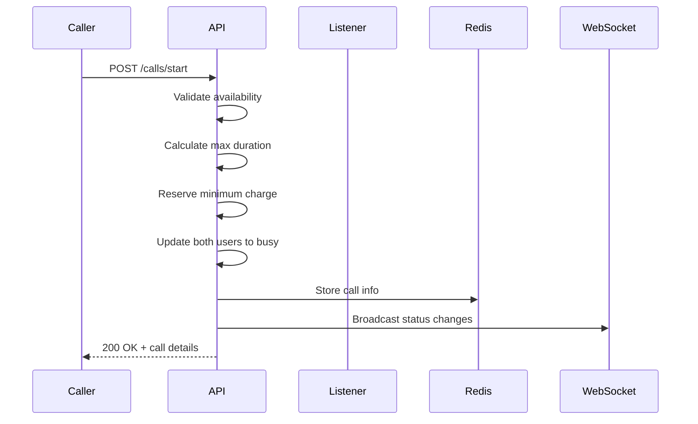
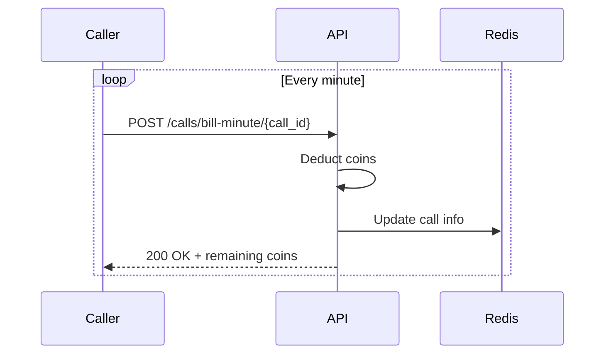
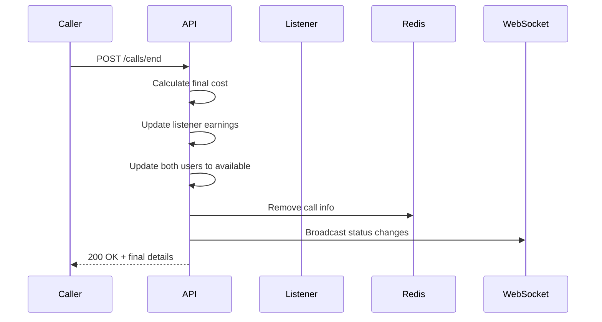

# Call Management API

The Call Management API provides comprehensive call lifecycle management with a coin-based billing system, real-time tracking, and automatic status updates.

## Overview

- **Call Lifecycle**: Start, manage, and end calls
- **Coin-based Billing**: Real-time billing with coin system
- **Status Management**: Automatic presence status updates
- **Call History**: Complete call history and analytics
- **Wallet Integration**: Coin balance and transaction management
- **Real-time Tracking**: Live call monitoring and updates

## Call Model

### Call Types

- **Audio Calls**: Voice-only calls
- **Video Calls**: Video and voice calls

### Call Statuses

- **Ongoing**: Call is currently active
- **Completed**: Call ended successfully
- **Dropped**: Call ended due to technical issues
- **Cancelled**: Call was cancelled before starting

### Billing System

- **Coins**: Virtual currency for call payments
- **Per-minute Billing**: Charges applied every minute
- **Minimum Charge**: Initial charge when call starts
- **Earnings**: Listeners earn coins from calls

## Endpoints

### Start Call

Start a new call with a listener.

**Endpoint:** `POST /calls/start`

**Headers:**
```
Authorization: Bearer <access_token>
Content-Type: application/json
```

**Request Body:**
```json
{
  "listener_id": 123,
  "call_type": "audio"
}
```

**Fields:**
- `listener_id`: ID of the listener to call
- `call_type`: "audio" or "video"

**Response:**
```json
{
  "call_id": 456,
  "message": "Call started successfully",
  "call_duration": 30,
  "remaining_coins": 700,
  "call_type": "audio",
  "listener_id": 123,
  "status": "ongoing"
}
```

**Behavior:**
- Validates user and listener availability
- Calculates maximum possible duration based on available coins
- Reserves minimum charge (10 coins for audio, 60 for video)
- **Auto-updates both users' presence status to busy**
- **Broadcasts status changes to all connected clients**
- Creates call record in database
- Stores call info in Redis for real-time tracking

### End Call

End an ongoing call.

**Endpoint:** `POST /calls/end`

**Headers:**
```
Authorization: Bearer <access_token>
Content-Type: application/json
```

**Request Body:**
```json
{
  "call_id": 456,
  "reason": "completed"
}
```

**Fields:**
- `call_id`: ID of the call to end
- `reason`: "completed", "dropped", "cancelled"

**Response:**
```json
{
  "call_id": 456,
  "message": "Call ended successfully",
  "duration_seconds": 1800,
  "duration_minutes": 30,
  "coins_spent": 300,
  "coins_spent": 300,
  "listener_money_earned": 240,
  "status": "completed"
}
```

**Behavior:**
- Calculates final duration and total cost
- Updates listener earnings (1.5x rate per minute)
- **Auto-updates both users' presence status to available**
- **Broadcasts status changes to all connected clients**
- Creates transaction records
- Removes from Redis tracking

### Get Ongoing Call

Get details of the current ongoing call.

**Endpoint:** `GET /calls/ongoing`

**Headers:**
```
Authorization: Bearer <access_token>
```

**Response:**
```json
{
  "call_id": 456,
  "user_id": 123,
  "listener_id": 789,
  "call_type": "audio",
  "start_time": "2024-01-15T10:30:00Z",
  "duration_seconds": 900,
  "coins_spent": 150,
  "remaining_coins": 350,
  "status": "ongoing"
}
```

**Response (No Ongoing Call):**
```json
{
  "call_id": null,
  "message": "No ongoing call"
}
```

### Get Call History

Get paginated call history with filtering options.

**Endpoint:** `GET /calls/history`

**Headers:**
```
Authorization: Bearer <access_token>
```

**Query Parameters:**

| Parameter | Type | Description | Default |
|-----------|------|-------------|---------|
| `page` | integer | Page number (1-based) | 1 |
| `per_page` | integer | Items per page (max 100) | 20 |
| `call_type` | string | Filter by call type ("audio", "video") | null |
| `status` | string | Filter by status ("ongoing", "completed", "dropped") | null |

**Example Request:**
```
GET /calls/history?page=1&per_page=10&call_type=audio&status=completed
```

**Response:**
```json
{
  "calls": [
    {
      "call_id": 456,
      "user_id": 123,
      "listener_id": 789,
      "call_type": "audio",
      "start_time": "2024-01-15T10:30:00Z",
      "end_time": "2024-01-15T11:00:00Z",
      "duration_seconds": 1800,
      "duration_minutes": 30,
      "coins_spent": 300,
      "coins_spent": 300,
      "listener_money_earned": 450,
      "status": "completed",
      "caller_username": "john_doe",
      "listener_username": "jane_smith"
    }
  ],
  "total_calls": 25,
  "total_coins_spent": 1500,
  "total_money_spent": 1500,
  "total_earnings": 2250,
  "page": 1,
  "per_page": 20,
  "has_next": true,
  "has_previous": false
}
```

### Get Call History Summary

Get call history summary with statistics.

**Endpoint:** `GET /calls/history/summary`

**Headers:**
```
Authorization: Bearer <access_token>
```

**Response:**
```json
{
  "summary": {
    "total_calls": 25,
    "calls_made": 15,
    "calls_received": 10,
    "completed_calls": 20,
    "dropped_calls": 3,
    "ongoing_calls": 2,
    "audio_calls": 18,
    "video_calls": 7,
    "total_coins_spent": 1500,
    "total_money_spent": 1500,
    "total_earnings": 2250,
    "total_duration_seconds": 54000,
    "avg_duration_seconds": 2160
  },
  "recent_calls": [
    {
      "call_id": 456,
      "call_type": "audio",
      "duration_minutes": 30,
      "coins_spent": 300,
      "status": "completed",
      "created_at": "2024-01-15T10:30:00Z"
    }
  ],
  "monthly_stats": [
    {
      "month": "2024-01-01T00:00:00Z",
      "calls_count": 8,
      "coins_spent": 400,
      "earnings": 600
    }
  ]
}
```

### Get Coin Balance

Get user's coin balance and transaction history.

**Endpoint:** `GET /calls/balance`

**Headers:**
```
Authorization: Bearer <access_token>
```

**Response:**
```json
{
  "user_id": 123,
  "current_balance": 500,
  "total_earned": 1000,
  "total_spent": 500,
  "recent_transactions": [
    {
      "transaction_id": "TXN_123_1640995200",
      "type": "call_payment",
      "amount": -50,
      "description": "Call payment - 5 minutes",
      "created_at": "2024-01-15T10:30:00Z"
    },
    {
      "transaction_id": "RCH_123_1640995200",
      "type": "recharge",
      "amount": 300,
      "description": "Coin recharge - ₹150",
      "created_at": "2024-01-15T09:00:00Z"
    }
  ]
}
```

### Recharge Coins

Add coins to user's wallet.

**Endpoint:** `POST /calls/recharge`

**Headers:**
```
Authorization: Bearer <access_token>
Content-Type: application/json
```

**Request Body:**
```json
{
  "amount_rupees": 150,
  "payment_method": "upi"
}
```

**Fields:**
- `amount_rupees`: Amount in Indian Rupees
- `payment_method`: Payment method ("upi", "card", "wallet")

**Response:**
```json
{
  "transaction_id": "RCH_123_1640995200",
  "amount_rupees": 150,
  "coins_added": 300,
  "new_balance": 500,
  "message": "Successfully recharged 300 coins for ₹150"
}
```

**Recharge Options:**
- ₹150 = 300 coins (2:1 ratio)
- ₹300 = 600 coins (2:1 ratio)
- ₹500 = 1000 coins (2:1 ratio)
- ₹1000 = 2000 coins (2:1 ratio)

### Get Recharge History

Get user's coin recharge history.

**Endpoint:** `GET /calls/recharge/history`

**Headers:**
```
Authorization: Bearer <access_token>
```

**Query Parameters:**
- `page`: Page number (default: 1)
- `per_page`: Items per page (default: 20, max: 100)

**Response:**
```json
{
  "recharges": [
    {
      "recharge_id": 123,
      "amount_paid": 150.00,
      "coins_received": 300,
      "payment_method": "razorpay",
      "transaction_id": "txn_abc123",
      "status": "completed",
      "created_at": "2024-01-15T10:30:00Z"
    },
    {
      "recharge_id": 124,
      "amount_paid": 300.00,
      "coins_received": 600,
      "payment_method": "razorpay",
      "transaction_id": "txn_def456",
      "status": "completed",
      "created_at": "2024-01-14T15:20:00Z"
    }
  ],
  "pagination": {
    "page": 1,
    "per_page": 20,
    "total": 2,
    "has_next": false,
    "has_previous": false
  }
}
```

### Bill Call Minute

Bill for one minute of call time.

**Endpoint:** `POST /calls/bill-minute/{call_id}`

**Headers:**
```
Authorization: Bearer <access_token>
```

**Path Parameters:**
- `call_id`: ID of the ongoing call

**Response:**
```json
{
  "call_id": 456,
  "coins_deducted": 10,
  "remaining_coins": 290,
  "total_coins_spent": 20,
  "message": "Successfully billed for 1 minute"
}
```

**Usage:**
- Called every minute during ongoing calls
- Deducts coins based on call type
- Returns error if insufficient coins

### Emergency End Call

Emergency end a call (admin or system use).

**Endpoint:** `POST /calls/emergency-end/{call_id}`

**Path Parameters:**
- `call_id`: ID of the call to end

**Response:**
```json
{
  "call_id": 123,
  "status": "emergency_ended",
  "duration_minutes": 15.5,
  "coins_spent": 155,
  "remaining_coins": 345,
  "message": "Call ended due to emergency"
}
```

### Cleanup Calls

Clean up expired or orphaned calls (admin use).

**Endpoint:** `POST /calls/cleanup`

**Response:**
```json
{
  "message": "Call cleanup completed",
  "calls_cleaned": 5,
  "calls_ended": 3,
  "calls_orphaned": 2
}
```

### Get Call System Status

Get current call system status and statistics.

**Endpoint:** `GET /calls/status`

**Response:**
```json
{
  "system_status": "operational",
  "active_calls": 12,
  "total_calls_today": 156,
  "average_call_duration": 18.5,
  "total_coins_processed": 45000,
  "listeners_online": 45,
  "listeners_busy": 8,
  "last_updated": "2024-01-15T10:30:00Z"
}
```

### Get Call Rates

Get current call rates and recharge options.

**Endpoint:** `GET /calls/rates`

**Response:**
```json
{
  "call_rates": {
    "audio": {
      "rate_per_minute": 10,
      "minimum_charge": 10
    },
    "video": {
      "rate_per_minute": 60,
      "minimum_charge": 60
    }
  },
  "recharge_options": {
    "150": 300,
    "300": 600,
    "500": 1000,
    "1000": 2000
  },
  "listener_earnings": {
    "audio": 1,
    "video": 6
  }
}
```

## Call Lifecycle

### 1. Call Start



### 2. Call Duration



### 3. Call End



## Billing System

### Call Rates

**Audio Calls:**
- Rate: 10 coins per minute
- Minimum charge: 10 coins
- Listener earnings: Variable based on badge (₹1-1.8 per minute)

**Video Calls:**
- Rate: 60 coins per minute  
- Minimum charge: 60 coins
- Listener earnings: Variable based on badge (₹6-10 per minute)

### Billing Process

1. **Call Start**: Reserve minimum charge
2. **Per-minute Billing**: Deduct coins every minute
3. **Call End**: Calculate final cost and update earnings
4. **Automatic Termination**: End call if insufficient coins

### Coin Management

- **Wallet Integration**: Uses existing `user_wallets` table
- **Transaction Tracking**: All movements recorded in `user_transactions`
- **Real-time Balance**: Live balance updates during calls
- **Recharge System**: Users can add coins with real money

## Error Handling

### Common Error Responses

**Insufficient Coins (400):**
```json
{
  "detail": "Insufficient coins. Required: 300, Available: 200"
}
```

**User Not Available (400):**
```json
{
  "detail": "User is not available for calls"
}
```

**Call Not Found (404):**
```json
{
  "detail": "Call not found"
}
```

**Invalid Call Type (400):**
```json
{
  "detail": "Invalid call type. Must be 'audio' or 'video'"
}
```

**Call Already Ongoing (400):**
```json
{
  "detail": "User already has an ongoing call"
}
```

## Integration Examples

### React Native Integration

```typescript
// Start call
const startCall = async (token: string, listenerId: number, callType: string) => {
  const response = await fetch('https://saathiiapp.com/calls/start', {
    method: 'POST',
    headers: {
      'Authorization': `Bearer ${token}`,
      'Content-Type': 'application/json'
    },
    body: JSON.stringify({
      listener_id: listenerId,
      call_type: callType,
      estimated_duration_minutes: 30
    })
  });
  return response.json();
};

// End call
const endCall = async (token: string, callId: number, reason: string) => {
  const response = await fetch('https://saathiiapp.com/calls/end', {
    method: 'POST',
    headers: {
      'Authorization': `Bearer ${token}`,
      'Content-Type': 'application/json'
    },
    body: JSON.stringify({
      call_id: callId,
      reason: reason
    })
  });
  return response.json();
};

// Get call history
const getCallHistory = async (token: string, filters: any) => {
  const params = new URLSearchParams();
  Object.entries(filters).forEach(([key, value]) => {
    if (value !== null && value !== undefined) {
      params.append(key, value.toString());
    }
  });

  const response = await fetch(`https://saathiiapp.com/calls/history?${params}`, {
    headers: {
      'Authorization': `Bearer ${token}`
    }
  });
  return response.json();
};

// Recharge coins
const rechargeCoins = async (token: string, amountRupees: number) => {
  const response = await fetch('https://saathiiapp.com/calls/recharge', {
    method: 'POST',
    headers: {
      'Authorization': `Bearer ${token}`,
      'Content-Type': 'application/json'
    },
    body: JSON.stringify({
      amount_rupees: amountRupees,
      payment_method: 'upi'
    })
  });
  return response.json();
};
```

### cURL Examples

**Start Call:**
```bash
curl -X POST 'https://saathiiapp.com/calls/start' \
  -H 'Authorization: Bearer <access_token>' \
  -H 'Content-Type: application/json' \
  -d '{
    "listener_id": 123,
    "call_type": "audio",
    "estimated_duration_minutes": 30
  }'
```

**End Call:**
```bash
curl -X POST 'https://saathiiapp.com/calls/end' \
  -H 'Authorization: Bearer <access_token>' \
  -H 'Content-Type: application/json' \
  -d '{
    "call_id": 456,
    "reason": "completed"
  }'
```

**Get Call History:**
```bash
curl -X GET 'https://saathiiapp.com/calls/history?page=1&per_page=10&call_type=audio' \
  -H 'Authorization: Bearer <access_token>'
```

**Recharge Coins:**
```bash
curl -X POST 'https://saathiiapp.com/calls/recharge' \
  -H 'Authorization: Bearer <access_token>' \
  -H 'Content-Type: application/json' \
  -d '{
    "amount_rupees": 150,
    "payment_method": "upi"
  }'
```

## Best Practices

### Call Management

1. **Availability Check**: Always check user availability before starting calls
2. **Coin Validation**: Validate sufficient coins before call start
3. **Status Updates**: Update UI immediately when call status changes
4. **Error Handling**: Handle all possible error scenarios

### Billing

1. **Per-minute Billing**: Implement reliable per-minute billing
2. **Balance Monitoring**: Monitor coin balance during calls
3. **Transaction Logging**: Log all coin transactions
4. **Recharge Options**: Provide multiple recharge options

### Real-time Updates

1. **WebSocket Integration**: Use WebSocket for live updates
2. **Status Broadcasting**: Broadcast status changes to all clients
3. **Connection Management**: Handle WebSocket disconnections
4. **Error Recovery**: Implement retry logic for failed operations

## Per-Minute Coin Deduction

### Background Task: Automatic Coin Deduction

Coins are automatically deducted every minute for all ongoing calls using a background task. This ensures fair billing without requiring external system integration.

**How it works:**
- Background service runs every minute via cron job
- Automatically processes all ongoing calls
- Deducts `rate_per_minute` for each active call
- Ends calls when users have insufficient coins
- Handles listener earnings and call settlement

**Configuration:**
- **Schedule**: Every minute (`* * * * *`)
- **Script**: `background_tasks/scripts/coin_deduction.py`
- **Logs**: `/var/log/saathii/coin_deduction.log`

**Benefits:**
- ✅ **Reliable**: No external dependencies
- ✅ **Scalable**: Handles thousands of calls efficiently
- ✅ **Automatic**: No manual intervention required
- ✅ **Fair Billing**: Precise per-minute charging
- ✅ **Error Handling**: Robust error recovery

**Setup:**
```bash
# Run the setup script to configure cron jobs
./background_tasks/scripts/setup_cron.sh
```

**Monitoring:**
```bash
# View real-time logs
tail -f /var/log/saathii/coin_deduction.log

# Check cron job status
crontab -l | grep coin_deduction
```

**Integration Notes:**
- This endpoint should be called every minute during active calls
- It automatically handles call termination when users run out of coins
- It updates both database and Redis cache
- It broadcasts presence changes via WebSocket
- It calculates fair listener earnings based on actual payment

**Error Handling:**
- Returns detailed error information for each call
- Continues processing other calls even if one fails
- Automatically ends calls when users have insufficient coins
- Maintains data consistency through database transactions

## Next Steps

- Learn about [WebSocket Real-time API](./websocket-realtime) for live updates
- Explore [Listener Verification API](./listener-verification) for verification process
- Check out [S3 File Upload API](./s3-file-upload) for file management
