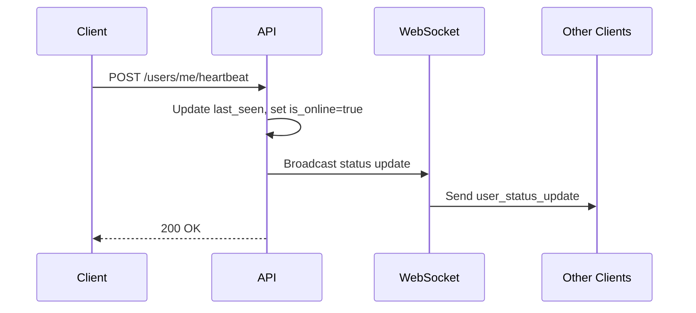
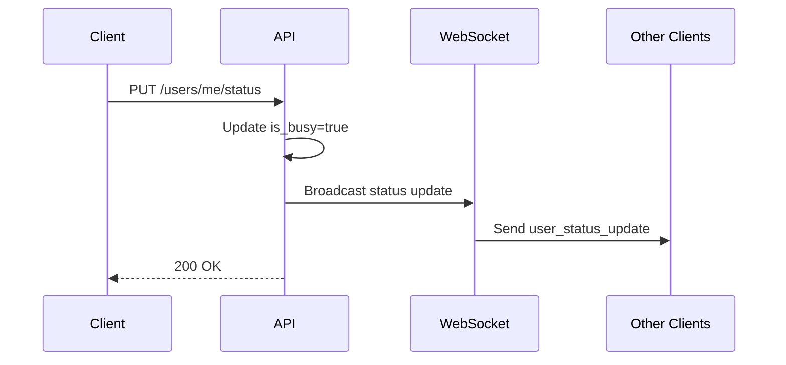
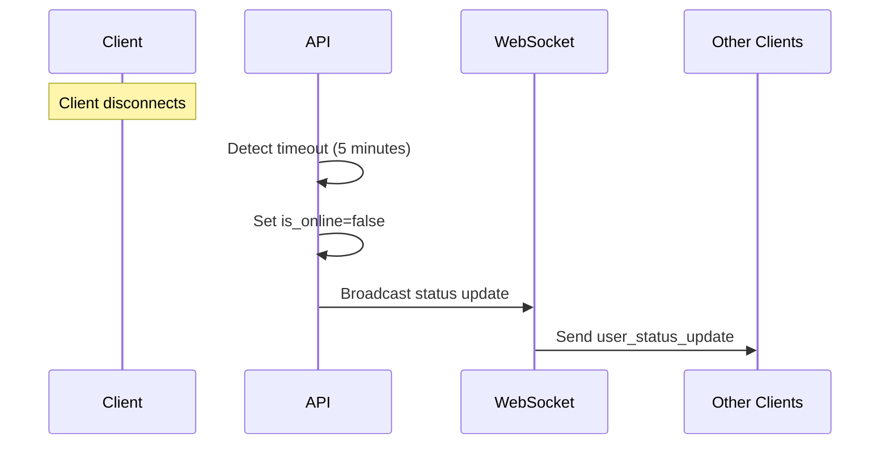

# Presence & Status API

The Presence & Status API provides real-time user presence tracking, status management, and heartbeat functionality for maintaining active user sessions.

## Overview

- **Real-time Presence**: Track user online/offline status
- **Status Management**: Manage busy/available states
- **Heartbeat System**: Keep user sessions active
- **WebSocket Integration**: Real-time status broadcasts
- **Automatic Cleanup**: Handle disconnected users

## Status Model

### Presence States

- **Online**: User is actively connected
- **Offline**: User is not connected
- **Last Seen**: Timestamp of last activity

### Availability States

- **Available**: User is online and not busy
- **Busy**: User is online but occupied (e.g., in a call)
- **Busy Until**: Optional timestamp when user will be available

## Endpoints

### Get My Status

Retrieve the current user's presence and status information.

**Endpoint:** `GET /users/me/status`

**Headers:**
```
Authorization: Bearer <access_token>
```

**Response:**
```json
{
  "user_id": 123,
  "is_online": true,
  "last_seen": "2024-01-15T10:30:00Z",
  "is_busy": false,
  "busy_until": null,
  "is_available": true
}
```

**Fields:**
- `user_id`: User identifier
- `is_online`: Whether user is currently online
- `last_seen`: Timestamp of last activity
- `is_busy`: Whether user is currently busy
- `busy_until`: When user will be available (if busy)
- `is_available`: Computed field: `is_online && !is_busy`

### Update My Status

Update the current user's presence and status.

**Endpoint:** `PUT /users/me/status`

**Headers:**
```
Authorization: Bearer <access_token>
Content-Type: application/json
```

**Request Body:**
```json
{
  "is_online": true,
  "is_busy": false,
  "busy_until": "2024-01-15T11:00:00Z"
}
```

**Fields:**
- `is_online` (optional): Set online status
- `is_busy` (optional): Set busy status
- `busy_until` (optional): Set when user will be available

**Response:**
```json
{
  "user_id": 123,
  "is_online": true,
  "last_seen": "2024-01-15T10:30:00Z",
  "is_busy": false,
  "busy_until": null,
  "is_available": true
}
```

**Real-time Broadcasting:**
- Status changes are broadcast to all connected WebSocket clients
- Other users see the status update immediately in their feed

### Heartbeat

Send a heartbeat to keep the user session active.

**Endpoint:** `POST /users/me/heartbeat`

**Headers:**
```
Authorization: Bearer <access_token>
```

**Response:**
```json
{
  "message": "Heartbeat received",
  "last_seen": "2024-01-15T10:30:00Z"
}
```

**Behavior:**
- Updates `last_seen` timestamp
- Triggers real-time broadcast to all connected clients
- Recommended frequency: Every 30 seconds
- Automatically sets `is_online` to `true`

### Get User Presence

Get the presence status of a specific user.

**Endpoint:** `GET /users/{user_id}/presence`

**Headers:**
```
Authorization: Bearer <access_token>
```

**Path Parameters:**
- `user_id`: ID of the user to check

**Response:**
```json
{
  "user_id": 456,
  "is_online": true,
  "last_seen": "2024-01-15T10:25:00Z",
  "is_busy": false,
  "busy_until": null,
  "is_available": true
}
```

### Get Multiple Users Presence

Get presence status for multiple users at once.

**Endpoint:** `GET /users/presence`

**Headers:**
```
Authorization: Bearer <access_token>
```

**Query Parameters:**
- `user_ids`: Comma-separated list of user IDs

**Example:**
```
GET /users/presence?user_ids=123,456,789
```

**Response:**
```json
[
  {
    "user_id": 123,
    "is_online": true,
    "last_seen": "2024-01-15T10:30:00Z",
    "is_busy": false,
    "busy_until": null,
    "is_available": true
  },
  {
    "user_id": 456,
    "is_online": false,
    "last_seen": "2024-01-15T09:45:00Z",
    "is_busy": false,
    "busy_until": null,
    "is_available": false
  },
  {
    "user_id": 789,
    "is_online": true,
    "last_seen": "2024-01-15T10:28:00Z",
    "is_busy": true,
    "busy_until": "2024-01-15T11:00:00Z",
    "is_available": false
  }
]
```

## WebSocket Integration

### Real-time Status Updates

Status changes are broadcast via WebSocket to all connected clients.

**WebSocket Endpoint:** `ws://localhost:8000/ws/presence?token=<access_token>`

**Message Types:**

**User Status Update:**
```json
{
  "type": "user_status_update",
  "user_id": 456,
  "status": {
    "user_id": 456,
    "username": "john_doe",
    "profile_image_url": "https://...",
    "is_online": true,
    "last_seen": "2024-01-15T10:30:00Z",
    "is_busy": false,
    "busy_until": null,
    "is_available": true
  }
}
```

**Connection Established:**
```json
{
  "type": "connection_established",
  "message": "Connected to presence updates",
  "user_id": 123
}
```

## Status Lifecycle

### 1. User Goes Online



### 2. User Goes Busy



### 3. User Goes Offline



## Automatic Status Management

### Call Integration

When users start or end calls, their status is automatically updated:

**Call Start:**
- Both caller and listener become `is_busy: true`
- Status broadcast to all connected clients

**Call End:**
- Both users become `is_busy: false`
- Status broadcast to all connected clients

### Timeout Handling

- **Heartbeat Timeout**: 5 minutes without heartbeat sets `is_online: false`
- **Automatic Cleanup**: Offline users are cleaned up after 1 hour
- **Reconnection**: Heartbeat automatically sets `is_online: true`

## Error Handling

### Common Error Responses

**User Not Found (404):**
```json
{
  "detail": "User not found"
}
```

**Invalid User ID (400):**
```json
{
  "detail": "Invalid user ID format"
}
```

**Unauthorized (401):**
```json
{
  "detail": "Could not validate credentials"
}
```

**Invalid Status (400):**
```json
{
  "detail": "Invalid status values"
}
```

## Integration Examples

### React Native Integration

```typescript
// Send heartbeat
const sendHeartbeat = async (token: string) => {
  const response = await fetch('http://localhost:8000/users/me/heartbeat', {
    method: 'POST',
    headers: {
      'Authorization': `Bearer ${token}`
    }
  });
  return response.json();
};

// Update status
const updateStatus = async (token: string, status: any) => {
  const response = await fetch('http://localhost:8000/users/me/status', {
    method: 'PUT',
    headers: {
      'Authorization': `Bearer ${token}`,
      'Content-Type': 'application/json'
    },
    body: JSON.stringify(status)
  });
  return response.json();
};

// Get user presence
const getUserPresence = async (token: string, userId: number) => {
  const response = await fetch(`http://localhost:8000/users/${userId}/presence`, {
    headers: {
      'Authorization': `Bearer ${token}`
    }
  });
  return response.json();
};

// WebSocket integration
const usePresenceWebSocket = (token: string) => {
  const [isConnected, setIsConnected] = useState(false);
  const [statusUpdates, setStatusUpdates] = useState([]);

  useEffect(() => {
    const ws = new WebSocket(`ws://localhost:8000/ws/presence?token=${token}`);
    
    ws.onopen = () => setIsConnected(true);
    ws.onclose = () => setIsConnected(false);
    
    ws.onmessage = (event) => {
      const message = JSON.parse(event.data);
      if (message.type === 'user_status_update') {
        setStatusUpdates(prev => [...prev, message]);
      }
    };

    return () => ws.close();
  }, [token]);

  return { isConnected, statusUpdates };
};
```

### cURL Examples

**Get My Status:**
```bash
curl -X GET 'http://localhost:8000/users/me/status' \
  -H 'Authorization: Bearer <access_token>'
```

**Update Status:**
```bash
curl -X PUT 'http://localhost:8000/users/me/status' \
  -H 'Authorization: Bearer <access_token>' \
  -H 'Content-Type: application/json' \
  -d '{
    "is_busy": true,
    "busy_until": "2024-01-15T11:00:00Z"
  }'
```

**Send Heartbeat:**
```bash
curl -X POST 'http://localhost:8000/users/me/heartbeat' \
  -H 'Authorization: Bearer <access_token>'
```

**Get User Presence:**
```bash
curl -X GET 'http://localhost:8000/users/456/presence' \
  -H 'Authorization: Bearer <access_token>'
```

**Get Multiple Users Presence:**
```bash
curl -X GET 'http://localhost:8000/users/presence?user_ids=123,456,789' \
  -H 'Authorization: Bearer <access_token>'
```

## Best Practices

### Heartbeat Management

1. **Frequency**: Send heartbeat every 30 seconds
2. **Background**: Use background tasks for heartbeat
3. **Reconnection**: Implement automatic reconnection on failure
4. **Battery**: Consider battery impact on mobile devices

### Status Updates

1. **Immediate**: Update status immediately when user actions change it
2. **Validation**: Validate status values before sending
3. **Error Handling**: Handle status update failures gracefully
4. **UI Feedback**: Show loading states during status updates

### WebSocket Integration

1. **Connection Management**: Handle connection drops gracefully
2. **Reconnection**: Implement exponential backoff for reconnection
3. **Message Handling**: Process WebSocket messages efficiently
4. **Memory Management**: Clean up old status updates to prevent memory leaks

## Next Steps

- Learn about [Feed System API](./feed-system) for discovering users
- Explore [WebSocket Real-time API](./websocket-realtime) for live updates
- Check out [Call Management API](./call-management) for call operations
