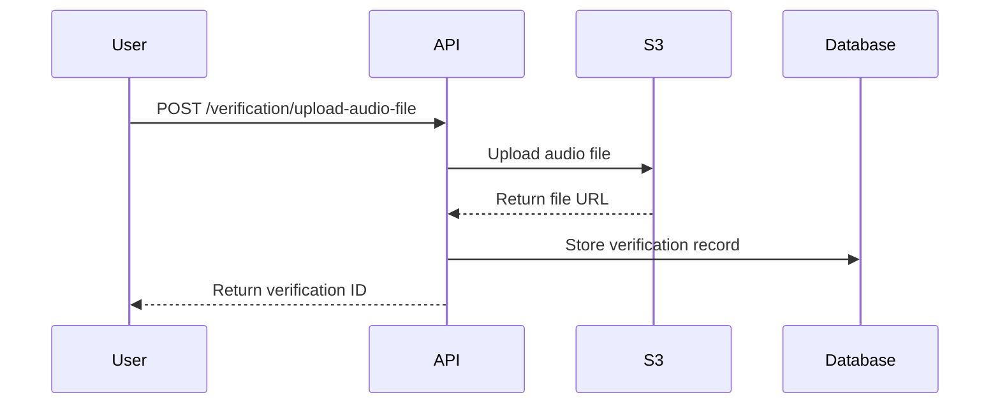
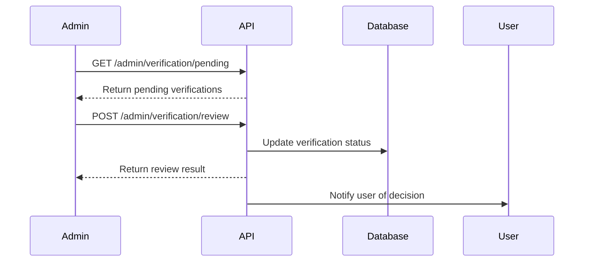

# Verification API

The Verification API provides a comprehensive system for listener verification through audio sample uploads and admin review processes.

## Overview

- **Audio Upload**: Upload verification audio files or URLs
- **Status Tracking**: Track verification status and history
- **Admin Review**: Admin review and approval system
- **S3 Integration**: Secure file storage with AWS S3

## Endpoints

### Upload Audio File

Upload an audio file for listener verification.

**Endpoint:** `POST /verification/upload-audio-file`

**Headers:**
```
Authorization: Bearer <access_token>
Content-Type: multipart/form-data
```

**Request Body:**
- `audio_file`: Audio file (MP3, WAV, M4A, etc.)
- `description`: Optional description of the audio sample

**Response:**
```json
{
  "verification_id": 123,
  "status": "pending",
  "audio_url": "https://s3.amazonaws.com/bucket/verification/123/audio.mp3",
  "uploaded_at": "2024-01-15T10:30:00Z",
  "message": "Audio file uploaded successfully"
}
```

**File Requirements:**
- **Formats**: MP3, WAV, M4A, AAC
- **Size**: Maximum 10MB
- **Duration**: 30 seconds to 5 minutes
- **Quality**: Clear, audible speech

### Upload Audio URL

Upload an audio file via URL for listener verification.

**Endpoint:** `POST /verification/upload-audio-url`

**Headers:**
```
Authorization: Bearer <access_token>
Content-Type: application/json
```

**Request Body:**
```json
{
  "audio_url": "https://example.com/audio-sample.mp3",
  "description": "Verification audio sample"
}
```

**Response:**
```json
{
  "verification_id": 124,
  "status": "pending",
  "audio_url": "https://example.com/audio-sample.mp3",
  "uploaded_at": "2024-01-15T10:30:00Z",
  "message": "Audio URL submitted successfully"
}
```

### Get Verification Status

Get current verification status for the user.

**Endpoint:** `GET /verification/status`

**Headers:**
```
Authorization: Bearer <access_token>
```

**Response:**
```json
{
  "user_id": 123,
  "verification_status": "pending",
  "current_verification": {
    "verification_id": 123,
    "status": "pending",
    "audio_url": "https://s3.amazonaws.com/bucket/verification/123/audio.mp3",
    "submitted_at": "2024-01-15T10:30:00Z",
    "reviewed_at": null,
    "reviewer_notes": null
  },
  "is_verified": false,
  "verification_count": 1
}
```

**Status Values:**
- `pending`: Awaiting admin review
- `approved`: Verification approved
- `rejected`: Verification rejected
- `expired`: Verification expired

### Get Verification History

Get verification history for the user.

**Endpoint:** `GET /verification/history`

**Headers:**
```
Authorization: Bearer <access_token>
```

**Response:**
```json
{
  "verifications": [
    {
      "verification_id": 123,
      "status": "approved",
      "audio_url": "https://s3.amazonaws.com/bucket/verification/123/audio.mp3",
      "submitted_at": "2024-01-15T10:30:00Z",
      "reviewed_at": "2024-01-15T11:00:00Z",
      "reviewer_notes": "Good quality audio, approved",
      "reviewer_id": 456
    },
    {
      "verification_id": 122,
      "status": "rejected",
      "audio_url": "https://s3.amazonaws.com/bucket/verification/122/audio.mp3",
      "submitted_at": "2024-01-14T15:30:00Z",
      "reviewed_at": "2024-01-14T16:00:00Z",
      "reviewer_notes": "Audio quality too poor, please resubmit",
      "reviewer_id": 456
    }
  ],
  "total_count": 2,
  "approved_count": 1,
  "rejected_count": 1
}
```

## Admin Endpoints

### Get Pending Verifications

Get all pending verifications for admin review.

**Endpoint:** `GET /admin/verification/pending`

**Headers:**
```
Authorization: Bearer <access_token>
```

**Response:**
```json
{
  "pending_verifications": [
    {
      "verification_id": 125,
      "user_id": 789,
      "username": "jane_listener",
      "audio_url": "https://s3.amazonaws.com/bucket/verification/125/audio.mp3",
      "submitted_at": "2024-01-15T10:30:00Z",
      "description": "Professional listener verification"
    },
    {
      "verification_id": 126,
      "user_id": 790,
      "username": "bob_listener",
      "audio_url": "https://s3.amazonaws.com/bucket/verification/126/audio.mp3",
      "submitted_at": "2024-01-15T09:15:00Z",
      "description": "New listener verification"
    }
  ],
  "total_pending": 2
}
```

### Review Verification

Review and approve/reject a verification.

**Endpoint:** `POST /admin/verification/review`

**Headers:**
```
Authorization: Bearer <access_token>
Content-Type: application/json
```

**Request Body:**
```json
{
  "verification_id": 125,
  "action": "approve",
  "reviewer_notes": "Excellent audio quality, clear pronunciation, approved"
}
```

**Actions:**
- `approve`: Approve the verification
- `reject`: Reject the verification

**Response:**
```json
{
  "verification_id": 125,
  "status": "approved",
  "reviewer_notes": "Excellent audio quality, clear pronunciation, approved",
  "reviewed_at": "2024-01-15T11:00:00Z",
  "reviewer_id": 456,
  "message": "Verification approved successfully"
}
```

## Verification Process

### 1. User Uploads Audio



### 2. Admin Review Process



## Error Responses

### 400 Bad Request
```json
{
  "detail": "Invalid file format. Supported formats: MP3, WAV, M4A, AAC"
}
```

### 413 Payload Too Large
```json
{
  "detail": "File too large. Maximum size: 10MB"
}
```

### 404 Not Found
```json
{
  "detail": "Verification not found"
}
```

### 403 Forbidden
```json
{
  "detail": "Admin access required"
}
```

## Integration Examples

### React Native Integration

```typescript
// services/VerificationService.ts
import ApiService from './ApiService';

export interface VerificationUpload {
  verification_id: number;
  status: string;
  audio_url: string;
  uploaded_at: string;
  message: string;
}

export interface VerificationStatus {
  user_id: number;
  verification_status: string;
  current_verification?: {
    verification_id: number;
    status: string;
    audio_url: string;
    submitted_at: string;
    reviewed_at?: string;
    reviewer_notes?: string;
  };
  is_verified: boolean;
  verification_count: number;
}

class VerificationService {
  // Upload audio file
  async uploadAudioFile(audioFile: File, description?: string): Promise<VerificationUpload> {
    const formData = new FormData();
    formData.append('audio_file', audioFile);
    if (description) {
      formData.append('description', description);
    }

    return ApiService.post<VerificationUpload>('/verification/upload-audio-file', formData, {
      headers: {
        'Content-Type': 'multipart/form-data',
      },
    });
  }

  // Upload audio URL
  async uploadAudioUrl(audioUrl: string, description?: string): Promise<VerificationUpload> {
    return ApiService.post<VerificationUpload>('/verification/upload-audio-url', {
      audio_url: audioUrl,
      description,
    });
  }

  // Get verification status
  async getVerificationStatus(): Promise<VerificationStatus> {
    return ApiService.get<VerificationStatus>('/verification/status');
  }

  // Get verification history
  async getVerificationHistory(): Promise<any> {
    return ApiService.get('/verification/history');
  }
}

export default new VerificationService();
```

### cURL Examples

```bash
# Upload audio file
curl -X POST "https://saathiiapp.com/verification/upload-audio-file" \
  -H "Authorization: Bearer <access_token>" \
  -F "audio_file=@/path/to/audio.mp3" \
  -F "description=Verification audio sample"

# Upload audio URL
curl -X POST "https://saathiiapp.com/verification/upload-audio-url" \
  -H "Authorization: Bearer <access_token>" \
  -H "Content-Type: application/json" \
  -d '{
    "audio_url": "https://example.com/audio-sample.mp3",
    "description": "Verification audio sample"
  }'

# Get verification status
curl -X GET "https://saathiiapp.com/verification/status" \
  -H "Authorization: Bearer <access_token>"

# Get verification history
curl -X GET "https://saathiiapp.com/verification/history" \
  -H "Authorization: Bearer <access_token>"

# Get pending verifications (Admin)
curl -X GET "https://saathiiapp.com/admin/verification/pending" \
  -H "Authorization: Bearer <admin_token>"

# Review verification (Admin)
curl -X POST "https://saathiiapp.com/admin/verification/review" \
  -H "Authorization: Bearer <admin_token>" \
  -H "Content-Type: application/json" \
  -d '{
    "verification_id": 125,
    "action": "approve",
    "reviewer_notes": "Excellent audio quality"
  }'
```

## Best Practices

### Audio Quality

1. **Clear Speech**: Ensure clear, audible speech
2. **Good Quality**: Use good quality recording equipment
3. **Appropriate Length**: 30 seconds to 5 minutes
4. **No Background Noise**: Minimize background noise

### File Management

1. **Format Support**: Use supported audio formats
2. **Size Limits**: Respect file size limits
3. **Secure Upload**: Use secure upload methods
4. **Error Handling**: Handle upload errors gracefully

### Admin Review

1. **Thorough Review**: Listen to entire audio sample
2. **Clear Notes**: Provide clear reviewer notes
3. **Consistent Standards**: Apply consistent review standards
4. **Timely Processing**: Process verifications promptly

## Next Steps

- Learn about [User Management API](./user-management) for profile operations
- Explore [Presence & Status API](./presence-status) for user status
- Check out [WebSocket Integration](./websocket-realtime) for real-time updates
