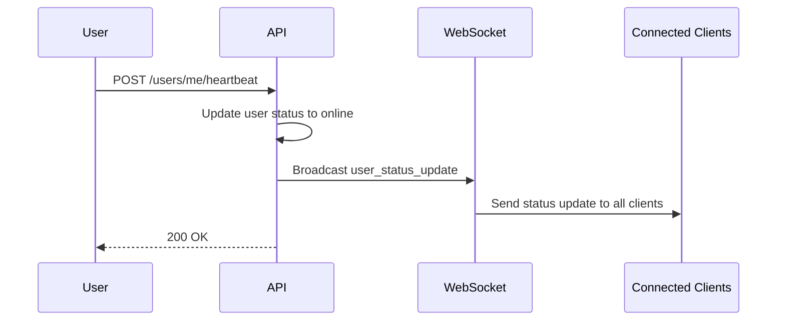
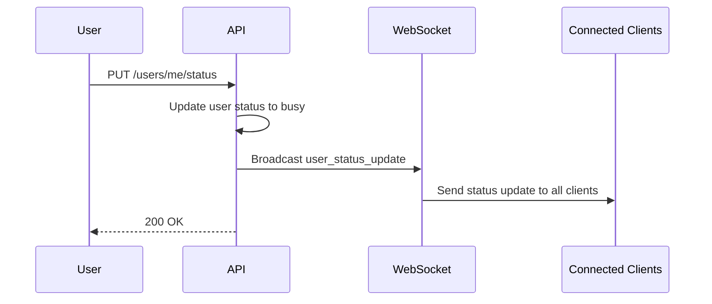
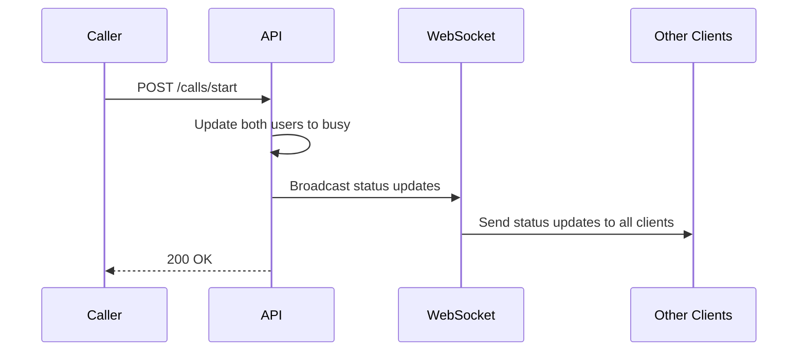

# WebSocket Real-time API

The WebSocket Real-time API provides live, bidirectional communication for real-time updates including user presence, feed changes, and call status updates.

## Overview

- **Real-time Updates**: Live status and feed updates
- **Bidirectional Communication**: Send and receive messages
- **Authentication**: JWT token-based authentication
- **Reconnection**: Automatic reconnection on connection loss
- **Multiple Channels**: Different WebSocket endpoints for different purposes

## WebSocket Endpoints

### Feed Updates WebSocket

Receive real-time updates for the feed page.

**Endpoint:** `ws://localhost:8000/ws/feed?token=<access_token>`

**Purpose:**
- User status updates (online/offline/busy)
- New users coming online
- User availability changes
- Feed statistics updates

### Presence Updates WebSocket

Receive real-time presence updates.

**Endpoint:** `ws://localhost:8000/ws/presence?token=<access_token>`

**Purpose:**
- User presence changes
- Status updates
- Heartbeat responses
- Connection status

## Message Types

### Incoming Messages

#### Connection Established

Sent when WebSocket connection is established.

```json
{
  "type": "connection_established",
  "message": "Connected to feed updates",
  "user_id": 123
}
```

#### User Status Update

Sent when a user's status changes.

```json
{
  "type": "user_status_update",
  "user_id": 456,
  "status": {
    "user_id": 456,
    "username": "john_doe",
    "profile_image_url": "https://example.com/profile.jpg",
    "is_online": true,
    "last_seen": "2024-01-15T10:30:00Z",
    "is_busy": false,
    "busy_until": null,
    "is_available": true
  }
}
```

#### Pong Response

Response to ping messages.

```json
{
  "type": "pong",
  "timestamp": "2024-01-15T10:30:00Z"
}
```

#### Error Message

Sent when an error occurs.

```json
{
  "type": "error",
  "message": "Invalid token",
  "code": "AUTH_ERROR"
}
```

### Outgoing Messages

#### Ping

Keep connection alive.

```json
{
  "type": "ping",
  "timestamp": "2024-01-15T10:30:00Z"
}
```

#### Subscribe

Subscribe to specific updates.

```json
{
  "type": "subscribe",
  "subscription": "feed"
}
```

## Real-time Flow

### 1. User Goes Online



### 2. User Goes Busy



### 3. Call Status Change



## WebSocket Lifecycle

### Connection Establishment

1. **Authentication**: Token validated on connection
2. **User Identification**: User ID extracted from token
3. **Channel Subscription**: User subscribed to relevant channels
4. **Initial State**: Current user status sent to client

### Message Processing

1. **Message Validation**: All messages validated for format
2. **Authentication Check**: Token validated for each message
3. **Rate Limiting**: Message rate limited per user
4. **Error Handling**: Invalid messages rejected with error

### Connection Management

1. **Heartbeat**: Ping/pong mechanism for connection health
2. **Reconnection**: Automatic reconnection on connection loss
3. **Cleanup**: User status updated on disconnection
4. **Resource Management**: Connections cleaned up on timeout

## Integration Examples

### React Native Integration

```typescript
// WebSocket hook for feed updates
const useFeedWebSocket = (token: string) => {
  const [isConnected, setIsConnected] = useState(false);
  const [connectionError, setConnectionError] = useState<string | null>(null);
  const [statusUpdates, setStatusUpdates] = useState([]);
  const wsRef = useRef<WebSocket | null>(null);
  const reconnectTimeoutRef = useRef<NodeJS.Timeout | null>(null);

  const connect = async () => {
    try {
      const wsUrl = `ws://localhost:8000/ws/feed?token=${token}`;
      const ws = new WebSocket(wsUrl);
      
      ws.onopen = () => {
        console.log('WebSocket connected');
        setIsConnected(true);
        setConnectionError(null);
      };

      ws.onmessage = (event) => {
        try {
          const message = JSON.parse(event.data);
          console.log('WebSocket message received:', message);
          
          switch (message.type) {
            case 'user_status_update':
              setStatusUpdates(prev => [...prev, message]);
              break;
            case 'pong':
              // Connection is alive
              break;
            case 'error':
              setConnectionError(message.message);
              break;
          }
        } catch (error) {
          console.error('Error parsing WebSocket message:', error);
        }
      };

      ws.onclose = (event) => {
        console.log('WebSocket disconnected:', event.code, event.reason);
        setIsConnected(false);
        
        // Attempt to reconnect if not a clean close
        if (event.code !== 1000) {
          reconnectTimeoutRef.current = setTimeout(() => {
            console.log('Attempting to reconnect...');
            connect();
          }, 5000);
        }
      };

      ws.onerror = (error) => {
        console.error('WebSocket error:', error);
        setConnectionError('WebSocket connection error');
      };

      wsRef.current = ws;
    } catch (error) {
      console.error('Error connecting to WebSocket:', error);
      setConnectionError('Failed to connect to WebSocket');
    }
  };

  const disconnect = () => {
    if (reconnectTimeoutRef.current) {
      clearTimeout(reconnectTimeoutRef.current);
    }
    if (wsRef.current) {
      wsRef.current.close(1000, 'User disconnected');
      wsRef.current = null;
    }
    setIsConnected(false);
  };

  const sendMessage = (message: any) => {
    if (wsRef.current && isConnected) {
      wsRef.current.send(JSON.stringify(message));
    }
  };

  const ping = () => {
    sendMessage({
      type: 'ping',
      timestamp: new Date().toISOString()
    });
  };

  useEffect(() => {
    connect();
    
    return () => {
      disconnect();
    };
  }, [token]);

  return {
    isConnected,
    connectionError,
    statusUpdates,
    connect,
    disconnect,
    sendMessage,
    ping
  };
};

// WebSocket hook for presence updates
const usePresenceWebSocket = (token: string) => {
  const [isConnected, setIsConnected] = useState(false);
  const [presenceUpdates, setPresenceUpdates] = useState([]);
  const wsRef = useRef<WebSocket | null>(null);

  useEffect(() => {
    const ws = new WebSocket(`ws://localhost:8000/ws/presence?token=${token}`);
    
    ws.onopen = () => setIsConnected(true);
    ws.onclose = () => setIsConnected(false);
    
    ws.onmessage = (event) => {
      const message = JSON.parse(event.data);
      if (message.type === 'user_status_update') {
        setPresenceUpdates(prev => [...prev, message]);
      }
    };

    wsRef.current = ws;

    return () => {
      if (wsRef.current) {
        wsRef.current.close();
      }
    };
  }, [token]);

  return { isConnected, presenceUpdates };
};
```

### JavaScript Integration

```javascript
// WebSocket connection for feed updates
class FeedWebSocket {
  constructor(token) {
    this.token = token;
    this.ws = null;
    this.isConnected = false;
    this.reconnectInterval = 5000;
    this.maxReconnectAttempts = 5;
    this.reconnectAttempts = 0;
  }

  connect() {
    try {
      const wsUrl = `ws://localhost:8000/ws/feed?token=${this.token}`;
      this.ws = new WebSocket(wsUrl);
      
      this.ws.onopen = () => {
        console.log('WebSocket connected');
        this.isConnected = true;
        this.reconnectAttempts = 0;
        this.onConnect?.();
      };

      this.ws.onmessage = (event) => {
        try {
          const message = JSON.parse(event.data);
          this.handleMessage(message);
        } catch (error) {
          console.error('Error parsing WebSocket message:', error);
        }
      };

      this.ws.onclose = (event) => {
        console.log('WebSocket disconnected:', event.code, event.reason);
        this.isConnected = false;
        this.onDisconnect?.(event);
        
        // Attempt to reconnect if not a clean close
        if (event.code !== 1000 && this.reconnectAttempts < this.maxReconnectAttempts) {
          setTimeout(() => {
            this.reconnectAttempts++;
            this.connect();
          }, this.reconnectInterval);
        }
      };

      this.ws.onerror = (error) => {
        console.error('WebSocket error:', error);
        this.onError?.(error);
      };
    } catch (error) {
      console.error('Error connecting to WebSocket:', error);
    }
  }

  handleMessage(message) {
    switch (message.type) {
      case 'user_status_update':
        this.onStatusUpdate?.(message);
        break;
      case 'pong':
        this.onPong?.(message);
        break;
      case 'error':
        this.onError?.(message);
        break;
      default:
        console.log('Unknown message type:', message.type);
    }
  }

  sendMessage(message) {
    if (this.ws && this.isConnected) {
      this.ws.send(JSON.stringify(message));
    }
  }

  ping() {
    this.sendMessage({
      type: 'ping',
      timestamp: new Date().toISOString()
    });
  }

  disconnect() {
    if (this.ws) {
      this.ws.close(1000, 'User disconnected');
      this.ws = null;
    }
    this.isConnected = false;
  }

  // Event handlers
  onConnect = null;
  onDisconnect = null;
  onStatusUpdate = null;
  onPong = null;
  onError = null;
}

// Usage
const feedWS = new FeedWebSocket(token);

feedWS.onConnect = () => {
  console.log('Connected to feed updates');
  // Send ping to keep connection alive
  feedWS.ping();
};

feedWS.onStatusUpdate = (message) => {
  console.log('Status update received:', message);
  // Update UI with new status
};

feedWS.onError = (error) => {
  console.error('WebSocket error:', error);
  // Handle error
};

feedWS.connect();
```

## Error Handling

### Connection Errors

**Authentication Error:**
```json
{
  "type": "error",
  "message": "Invalid token",
  "code": "AUTH_ERROR"
}
```

**Rate Limit Error:**
```json
{
  "type": "error",
  "message": "Rate limit exceeded",
  "code": "RATE_LIMIT_ERROR"
}
```

**Invalid Message Error:**
```json
{
  "type": "error",
  "message": "Invalid message format",
  "code": "INVALID_MESSAGE_ERROR"
}
```

### Reconnection Strategy

1. **Exponential Backoff**: Increase delay between reconnection attempts
2. **Maximum Attempts**: Limit number of reconnection attempts
3. **Clean Disconnect**: Close connection properly on app shutdown
4. **State Recovery**: Recover connection state after reconnection

## Best Practices

### Connection Management

1. **Single Connection**: Use one WebSocket connection per user
2. **Proper Cleanup**: Close connections when not needed
3. **Reconnection Logic**: Implement robust reconnection strategy
4. **Error Handling**: Handle all connection errors gracefully

### Message Handling

1. **Message Validation**: Validate all incoming messages
2. **Error Recovery**: Implement error recovery mechanisms
3. **Rate Limiting**: Respect server rate limits
4. **Memory Management**: Clean up old messages to prevent memory leaks

### Performance

1. **Ping/Pong**: Use ping/pong to keep connection alive
2. **Message Batching**: Batch multiple updates when possible
3. **Selective Updates**: Only process relevant message types
4. **Connection Pooling**: Reuse connections when possible

## Security Considerations

### Authentication

1. **Token Validation**: Validate JWT tokens on connection
2. **Token Refresh**: Handle token expiration gracefully
3. **Secure Connections**: Use WSS in production
4. **Rate Limiting**: Implement client-side rate limiting

### Data Protection

1. **Message Encryption**: Encrypt sensitive messages
2. **Input Validation**: Validate all message inputs
3. **Error Information**: Don't expose sensitive error details
4. **Access Control**: Implement proper access controls

## Next Steps

- Learn about [Call Management API](./call-management) for call operations
- Explore [Listener Verification API](./listener-verification) for verification process
- Check out [S3 File Upload API](./s3-file-upload) for file management
